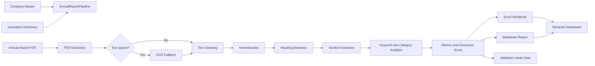

# Annual Report Disclosure Analysis

A production-oriented Python and NLP research pipeline for extracting, measuring,
validating, and visualizing artificial intelligence, digital transformation, and
innovation disclosures in annual reports of Indian listed companies.

## Project Overview

Annual reports contain valuable evidence about how companies discuss technology,
innovation, automation, analytics, research, and intellectual property. Manual
review is accurate but difficult to scale across companies and reporting years.
This project provides a reproducible workflow that converts annual report PDFs
into structured disclosure metrics and review-ready outputs.

The system performs native PDF extraction, applies OCR when a report appears to
be scanned, cleans and normalizes the text, identifies relevant report sections,
counts dictionary terms, calculates transparent metrics and scores, exports Excel
workbooks, and presents the generated results in a Streamlit dashboard.

The dashboard is visualization-only. It reads pipeline outputs and never performs
PDF extraction.

## Features

- Native PDF extraction with PyMuPDF and pdfplumber fallback
- OCR fallback for scanned or text-sparse reports
- Text cleaning that preserves disclosure-relevant language
- Unicode, punctuation, whitespace, and heading normalization
- Fuzzy-aware annual report heading detection
- Extraction of relevant sections such as MD&A, Innovation, AI, Automation,
  Technology, Patents, Future Strategy, and Research & Development
- Configurable Excel-based innovation dictionary
- Exact, case-insensitive, multi-word keyword counting
- Category counts, density, presence, and percentage contribution
- Transparent disclosure metrics and weighted scoring
- Manual-versus-automated validation with precision, recall, F1, and accuracy
- Company-specific Excel workbooks, normalized text, and Markdown reports
- Batch processing with per-company failure isolation
- Interactive Streamlit overview, company analysis, and comparison pages
- Pytest coverage for pipeline and keyword-analysis behavior

## Project Architecture



The architecture separates extraction, preprocessing, analysis, scoring,
validation, export, orchestration, and presentation. This keeps analytical logic
independent from the dashboard and makes individual stages testable.

## Folder Structure

```text
AI-Annual-Report/
├── config/
│   └── settings.py
├── dashboard/
│   ├── app.py
│   └── pages/
│       ├── overview.py
│       ├── company_analysis.py
│       └── comparison.py
├── data/
│   ├── dictionaries/
│   │   └── Innovation_Dictionary.xlsx
│   ├── metadata/
│   │   └── Company_Master.xlsx
│   ├── raw/annual_reports/
│   └── validation/
│       └── Validation.xlsx
├── documentation/
├── outputs/
│   ├── excel/
│   ├── extracted_text/
│   └── reports/
├── scripts/
│   └── run_pipeline.py
├── src/
│   ├── export/
│   ├── extraction/
│   ├── keyword_analysis/
│   ├── models/
│   ├── preprocessing/
│   ├── scoring/
│   ├── section_extraction/
│   ├── services/
│   ├── utils/
│   └── validation/
└── tests/
```

## Technologies Used

- Python 3.12
- pandas for tabular data and Excel integration
- PyMuPDF and pdfplumber for PDF text extraction
- Tesseract OCR, pytesseract, and pdf2image for scanned reports
- regex and RapidFuzz for text and fuzzy heading processing
- openpyxl for Excel output
- Streamlit for the dashboard
- Plotly for interactive charts
- pytest and `unittest.mock` for automated tests

## Installation

Clone the repository from its Git hosting page, enter the project directory, and
create an isolated environment:

```bash
cd AI-Annual-Report
python -m venv .venv
```

Activate it on Windows PowerShell:

```powershell
.\.venv\Scripts\Activate.ps1
```

Activate it on Linux or macOS:

```bash
source .venv/bin/activate
```

Install project dependencies:

```bash
python -m pip install --upgrade pip
pip install -r requirements.txt
```

To install the runtime and test packages explicitly instead of using the manifest:

```bash
pip install pandas pymupdf pdfplumber openpyxl regex rapidfuzz
pip install pytesseract pdf2image pillow streamlit plotly pytest
```

OCR additionally requires Tesseract OCR and, for `pdf2image`, Poppler to be
installed at operating-system level. See
[`documentation/Installation_Guide.md`](documentation/Installation_Guide.md) for
platform-specific preparation.

## Input Preparation

### Company Master

Place `Company_Master.xlsx` in `data/metadata/`. Each populated row must provide:

| Column | Description |
|---|---|
| `Company Name` | Full company name |
| `Ticker` | Exchange ticker or stable company identifier |
| `Industry` | Industry or sector |
| `Report Year` | Four-digit year or financial year beginning with one |
| `Report Path` | Absolute path or path relative to the project/master file |
| `Source URL` | Valid HTTP or HTTPS source URL |

Common aliases such as `Company`, `Symbol`, `Sector`, `Year`, `PDF Path`, and
`Report URL` are also recognized.

### Innovation Dictionary

Place `Innovation_Dictionary.xlsx` in `data/dictionaries/` with these columns:

| Column | Required | Description |
|---|---:|---|
| `Category` | Yes | Disclosure category |
| `Keyword` | Yes | Word or multi-word phrase |
| `Rationale` | No | Research rationale for the term |

Duplicate normalized category-keyword pairs are ignored with a warning.

### Annual Reports

Store PDF reports under `data/raw/annual_reports/` or reference them with valid
absolute or relative paths from the Company Master.

## Usage

Run all configured reports:

```bash
python scripts/run_pipeline.py
```

The no-filter command processes all Company Master records. The explicit form is:

```bash
python scripts/run_pipeline.py --all
```

### Example Commands

Process one ticker:

```bash
python scripts/run_pipeline.py --company TCS
```

Process a reporting year:

```bash
python scripts/run_pipeline.py --year 2024
```

Process one company and year:

```bash
python scripts/run_pipeline.py --company TCS --year 2024
```

Use another output root:

```bash
python scripts/run_pipeline.py --all --output output/
```

Override reference files:

```bash
python scripts/run_pipeline.py \
  --company-master data/metadata/Company_Master.xlsx \
  --dictionary data/dictionaries/Innovation_Dictionary.xlsx
```

The command returns exit code `0` when every selected report succeeds, `1` when
one or more reports fail, and `2` for initialization or selection errors.

## Dashboard

Launch the visualization application after generating workbooks:

```bash
streamlit run dashboard/app.py
```

The dashboard automatically scans `outputs/excel/` and the optional
`output/excel/` override location. It provides:

- Portfolio KPIs and score distributions
- Top and bottom company rankings
- Category and industry analysis
- Company/year selection with keyword and section detail
- Markdown report downloads
- Multi-company score, category, density, and section-coverage comparisons

Unreadable or missing workbooks are reported in the interface without crashing
the dashboard.

## Output Files

For each successful company/year record, the pipeline generates:

```text
outputs/
├── excel/
│   └── <ticker>_<year>_analysis.xlsx
├── extracted_text/
│   └── <ticker>_<year>_extracted.txt
└── reports/
    └── <ticker>_<year>_report.md
```

Each Excel workbook contains:

- `Disclosure Scores` — score, components, and core metrics
- `Category Counts` — category count, density, presence, and contribution
- `Section Summary` — detected-section lengths and previews
- `Validation Ready` — automated keyword counts and manual-review fields

Runtime logs are written to `logs/ai_annual_report.log` when file logging is
enabled in `config/settings.py`.

## Testing

Run the complete suite:

```bash
python -m pytest -q
```

Run the pipeline and keyword-analysis suites separately:

```bash
python -m pytest tests/test_pipeline.py -q
python -m pytest tests/test_keyword_analysis.py -q
```

The tests use temporary directories and mocks for external PDF, OCR, dictionary,
and export boundaries. No production annual report is modified.

## Future Improvements

- Add longitudinal panel-data exports spanning multiple reporting years
- Add human annotation interfaces for keyword-context validation
- Introduce sentence-level contextual relevance classifiers
- Expand multilingual OCR and Indian-language disclosure support
- Add CI workflows with coverage, linting, and dependency security checks
- Add container images with pinned OCR and Poppler dependencies
- Support centralized object storage for reports and generated artifacts
- Calibrate scoring benchmarks using a larger manually reviewed sample

## License

No software license has been declared yet because the repository's `LICENSE`
file is empty. The repository owner must add an approved license before public
distribution or reuse.

## Author

Developed as an annual report disclosure analysis and NLP research project.
Project metadata and ownership details should be maintained by the repository
owner in release documentation.
